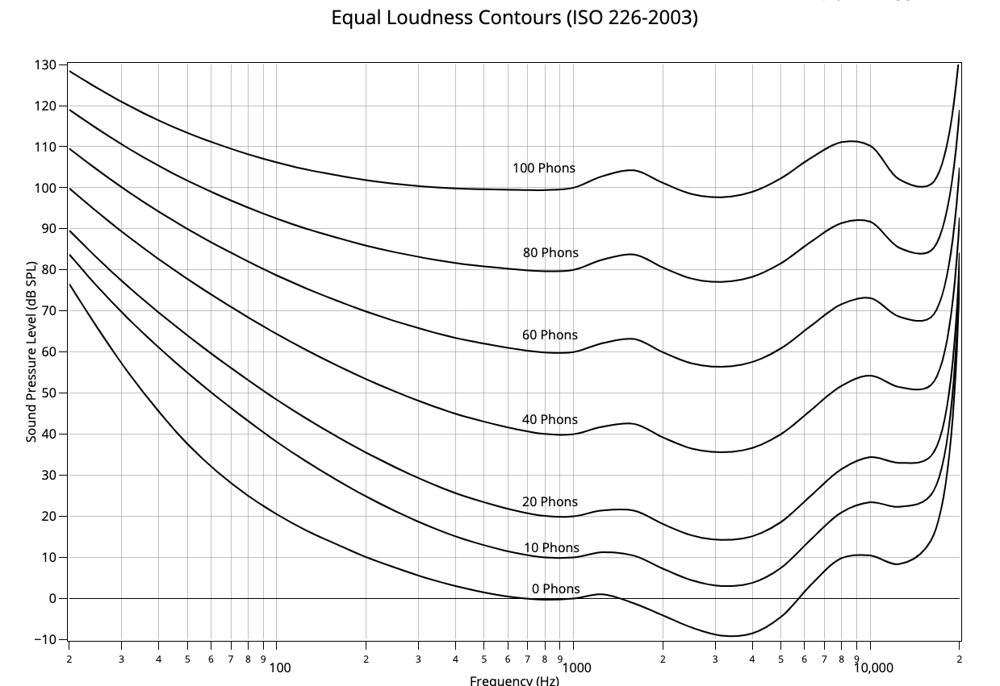

# EQ for Equal Loudness

## Scope

This project estimates equalisation curves (EQ) to adapt audio for different sound pressure levels. By applying the compensation curves, the EQ can be adjusted to be perceived more like an 85dB reference.

## Background

An ["equal-loudness contour"](https://en.wikipedia.org/wiki/Equal-loudness_contour) is a measure of sound pressure level, over the frequency spectrum, for which a listener perceives a constant loudness when presented with pure steady tones. The unit of measurement for loudness levels is the phon and is arrived at by reference to equal-loudness contours. By definition, two sine waves of differing frequencies are said to have equal-loudness level measured in phons if they are perceived as equally loud by the average young person without significant hearing impairment.  [Source: Wikipedia "Equal-loudness contour"](https://en.wikipedia.org/wiki/Equal-loudness_contour)

These curves reveal that changes in volume affect perception of different frequencies differently which changes the balance of frequencies. For example, increasing volume tends to disproportionately increase the perceived volume of the bass and high-frequencies.

Correct audio balance is critical to audio engineering - particularly when mixing and mastering. The typical sound-pressure-level (SPL) for audio engineering is around 85dB. However, if an engineer is mixing at quieter levels, the low-end and high-end will be perceived relatively more quiet that the mid-range. So engineering at a quieter level can lead to audio that is imbalanced -- likely with too much bass and highs.

This project estimates equalisation curves (EQ) to adapt audio for different sound pressure levels. By applying the compensation curves, the EQ can be adjusted to be perceived more like an 85dB reference.

| EQ Curve | Effect |
| -------- | ------ |
| 80dB | EQ curve for an 80dB environment to simulate 85db balance |

## References

* Wikipedia article: ["Equal-loudness contour"](https://en.wikipedia.org/wiki/Equal-loudness_contour)
* ISO Standard: [ISO 226:2003 Acoustics — Normal equal-loudness-level contours](https://www.iso.org/standard/34222.html) (not free)
* [Sample chart](https://chart-studio.plotly.com/~mrlyule/16.embed)

