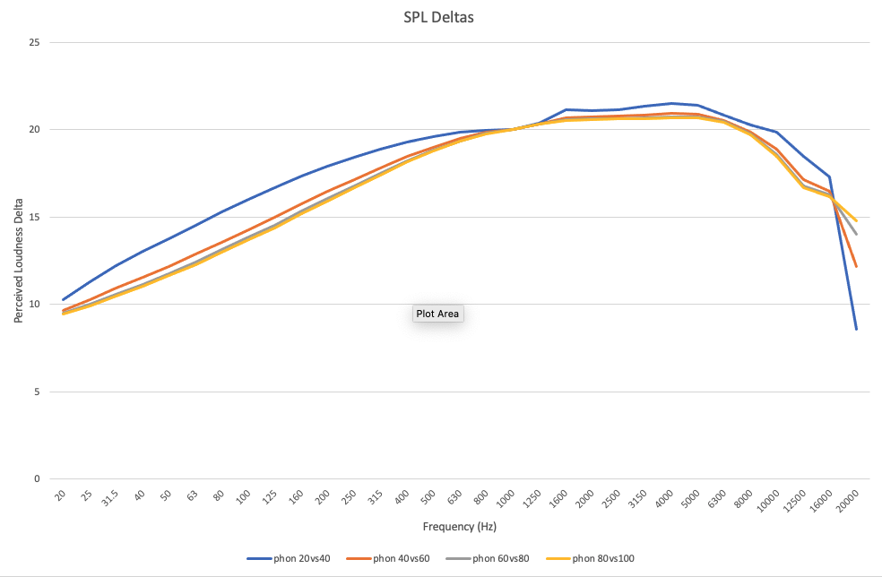

# EQ for Equal Loudness

> **Use simple EQ to simulate the audio balance at a different loudness without changing your volume. Improve the bass-mid-high balance in your mixing and mastering.**

## Overview

Human hearing perceives the balance of low-mid-high frequencies differently at different volumes. Typically, louder volumes will boost the perception of bass (particularly) and highs more than mid-range.

This project estimated equalisation curves (EQ) to adapt audio for different sound pressure levels -- but without changing the volume.

For example, if a speaker system is configured for a SPL 70dB reference level, then a +10dB EQ will simulate the perceived balance as if the actual SPL is 80dB (with boosted bass and highs).

I run my home studio around 65-70dB. That means I tend to create mixes and masters with too much bass. By applying the +10dB EQ simulation, I get better balanced audio as if I was actually listening at 75-80dB.

The estimates are derived from the [equal-loudness contour](https://en.wikipedia.org/wiki/Equal-loudness_contour) from the ISO 226:2003 standard.

The EQ Parameters section has sample EQ settings. The sections below explain how these parameters are estimated.

## EQ Parameters

NOTE: the Q parameter may need adjustment for different EQ systems. See the section on "EQ for 80dB" for EQ charts.

| Simulated dB | Low filter | Mid filter   | High filter  |
| --------     | ------     | ------       | ------       |
|              | Type: Bell | Type: Bell   | Type: Bell   |
|              | Freq: 25Hz | Freq: 2500Hz | Freq: 16kHz  |
|              | Q: 0.1     | Q: 0.4       | Q: 0.2       |
| Δ +10dB      | Boost: +2.82db | Boost: −2.52dB | Boost: −0.30dB |
| Δ +5dB       | Boost: +1.41dB | Boost: −1.26dB | Boost: −0.15dB |
| Δ 0dB (flat) | Boost:  0.00dB | Boost:  0.00dB | Boost:  0.00dB |
| Δ -5dB       | Boost: −1.40dB | Boost: +1.25dB | Boost: +0.15dB |
| Δ -10dB      | Boost: −2.81dB | Boost: +2.50dB | Boost: +0.31dB  |

_+10dB Simulator in Sonarworks SoundID Reference as a Custom Target_

_+10dB Simulator in Logic Pro EQ_

## Equal-Loudness Contours

[Source: Wikipedia "Equal-loudness contour"](https://en.wikipedia.org/wiki/Equal-loudness_contour)

An "equal-loudness contour" is a measure of sound pressure level, over the frequency spectrum, for which a listener perceives a constant loudness when presented with pure steady tones. The unit of measurement for loudness levels is the phon and is arrived at by reference to equal-loudness contours. By definition, two sine waves of differing frequencies are said to have equal-loudness level measured in phons if they are perceived as equally loud by the average young person without significant hearing impairment.  

These curves show that changes in volume affect perception of different frequencies differently which changes the balance of frequencies. For example, increasing volume tends to disproportionately increase the perceived volume of the bass and high-frequencies.

Correct audio balance is critical to audio engineering - particularly when mixing and mastering. The typical sound-pressure-level (SPL) for audio engineering is around 85dB. However, if an engineer is mixing at quieter levels, the low-end and high-end will be perceived relatively more quiet that the mid-range. So engineering at a quieter level can lead to audio that is imbalanced -- likely with too much bass and highs.

## SPL Deltas

The SPL Deltas chart shows the relative change in perceived loudness for different phon levels. Importantly, in the range of 40-100dB which covers nearly all sound studio work, the differences are very similar. This means that the same EQ curves can be used at any volume within that range. (The small differences are likely less important that other factors like speaker performance and the EQ design.)

_SPL Deltas_

## EQ for 80dB

So, we'll use 80dB as the reference for generating the EQs. The chart shows the target EQ curves that we would use for a system at 80dB to simulate the perceived frequency balance at higher and lower volumes without actually changing the volume.

Columns 2-5 show the boost/reduction at 4 key frequencies - 25Hz, 200Hz, 2500Hz, 16kHz. These are the adjustments to the low-mid-high frequencies to estimate the perceived human differences.

However, these boosts will increase/decrease the overall perceived volume. So, the "Average" column calculates the average of those 4 boosts/reductions as an estimate of the aggregate volume change.

Columns 7-10 adjust the boost/reduction by the average as an approximation of a loudness-neutral EQ. That is, by applying these boost/reduction filters the overall sound will be around the same volume (though that will depend a lot on the sound that is playing).  Think of this as a bit like the "Make up" gain on a plug-in.

Each row corresponds to a different simulated loudness. For example, the first row for "+10dB" defines the approximate balance of 90dB but when listening at 80dB.

| Simulated dB | 25Hz | 200Hz | 2500Hz | 16kHz | Average | Bal 25Hz | Bal 200Hz | Bal 2500Hz | Bal 16kHz |
| -------- | ------ | ------ | ------ | ------ | ------ | ------ | ------ | ------ | ------ |
| Δ +10dB | 5.04dB | 2.04dB | −0.30dB | 1.92dB | *2.22dB* | 2.82dB | −0.18dB | −2.52dB | −0.30dB |
| Δ +5dB | 2.52dB | 1.02dB | −0.15dB | 0.96dB | *1.11dB* | 1.41dB | −0.09dB | −1.26dB | −0.15dB |
| Δ +0dB | 0.00dB | 0.00dB | 0.00dB | 0.00dB | *0.00dB* | 0.00dB | 0.00dB | 0.00dB | 0.00dB |
| Δ -5dB | −2.50dB | −0.98dB | 0.16dB | −0.94dB | *−1.10dB* | −1.40dB | 0.11dB | 1.25dB | 0.15dB |
| Δ -10dB | −5.00dB | −1.97dB | 0.31dB | −1.88dB | *−2.19dB* | −2.81dB | 0.22dB | 2.50dB | 0.31dB |

## EQ Parameters for 80dB

Finally, we convert the balanced boost+frequency table to a set of EQ parameters.

This step depends upon the choice of EQ plug-in. This work was designed to work with SoundID Reference from [Sonarworks](https://www.sonarworks.com) and also tested with Logic Pro's standard EQ plugin.

The table at the top of this page shows the parameters:
* Simulations of perceived balance at +10db, +5db, 0db (flat), -5db, -10db
* 3 bell filters centered on 25Hz, 2500Hz, 16kHz
* Boost/reduction from the table above under EQ for 80dB
* Q estimated by manually comparing the chart in EQ for 80dB against the graph in Sonarworks and Logic Pro

By using more points on the EQ curve, it is possible to create a more accurate filter. I use 3 because that's what is supported by "Custom Target" EQ in Sonarworks.

## Implementation

To use the following, download this Git project and open either of these files.

`loudness-eq.html`: The [EQ and chart generation software](loudness-eq.html) for this project is a single HTML file that generates the various charts and tables. It was tested in April 2021 on a Mac in 3 browsers - Brave, Chrome and Safari.

`iso226-curves.xlsx`: The [Excel document](iso226-curves.xlsx) has the same data but different graphics.

## References

* [EQ and chart generation software](loudness-eq.html) for this project
* Wikipedia article: [Equal-loudness contour](https://en.wikipedia.org/wiki/Equal-loudness_contour)
* ISO Standard: [ISO 226:2003 Acoustics — Normal equal-loudness-level contours](https://www.iso.org/standard/34222.html) (not free)
* Sweetwater: [How Loud Should You Mix?](https://www.sweetwater.com/insync/how-loud-should-you-mix/)
* [Sample ISO 226 chart](https://chart-studio.plotly.com/~mrlyule/16.embed)
